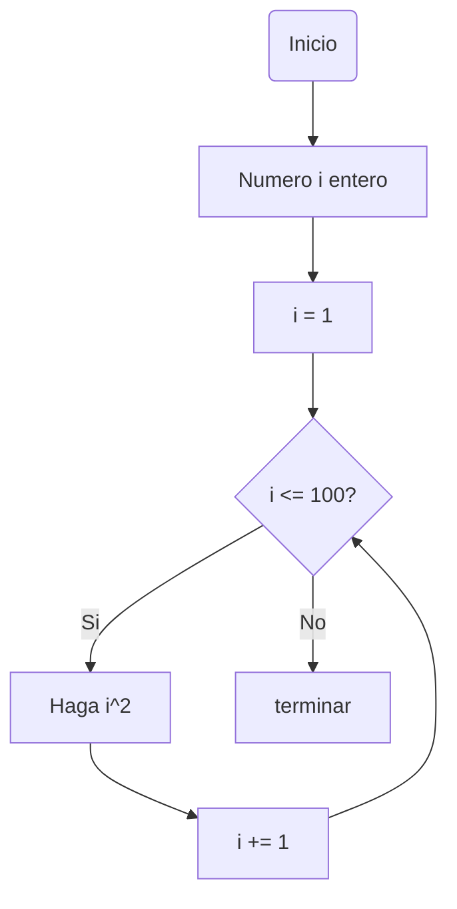
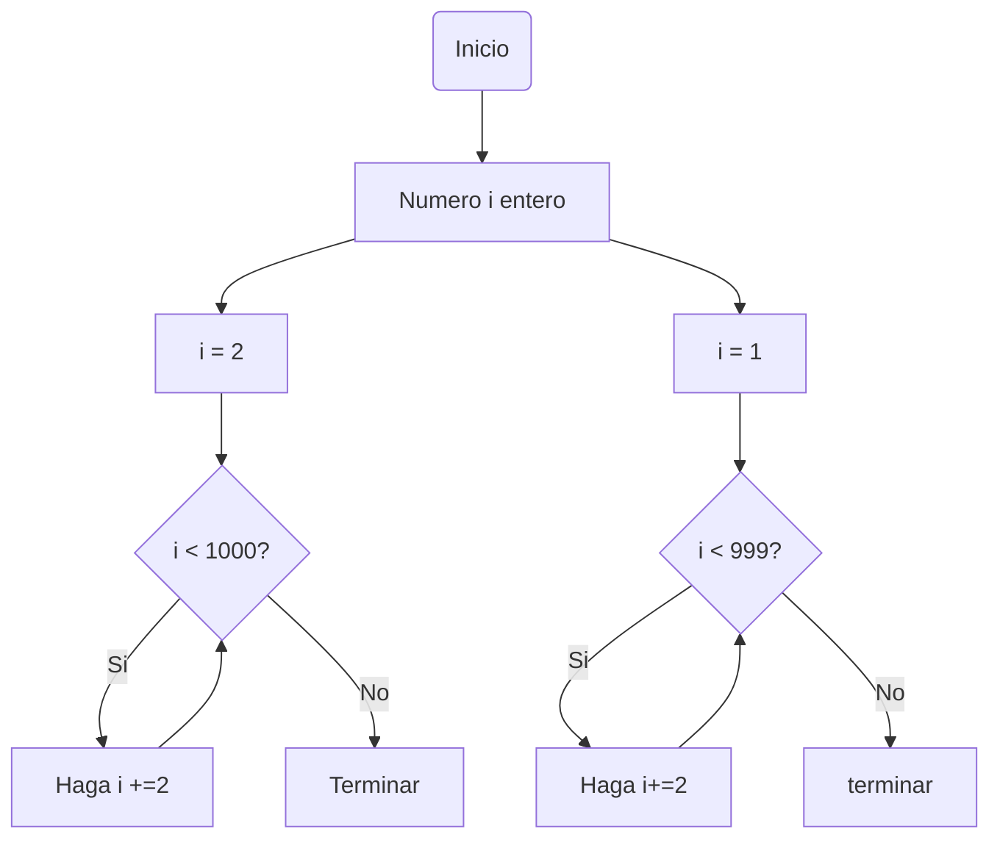
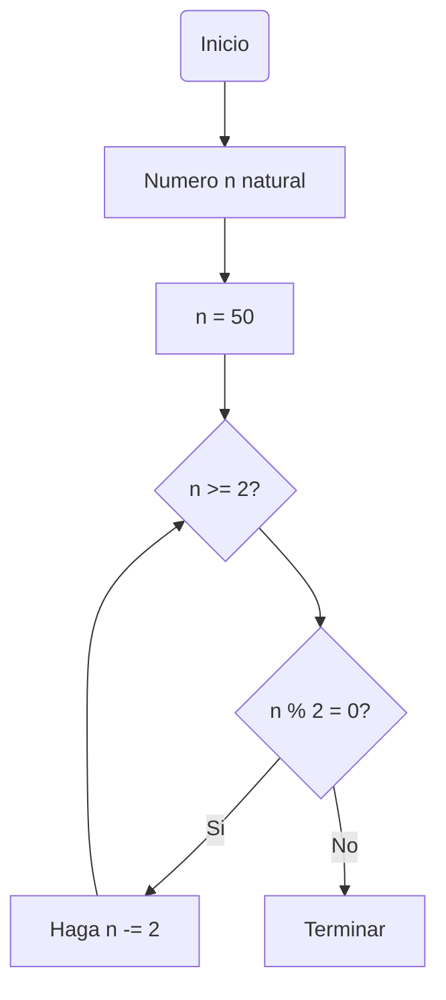

# Reto-siete

A continuacion los codigos propuestos del reto siete, cada uno con su arhivo.py individual y un notebook con todos estos incluidos:

### Codigo numero 1

- Imprimir un listado con los números del 1 al 100 cada uno con su respectivo cuadrado.

```Python

# Definir desde que valor se evaluara la condicion
i : int = 1

# Definir la condicion del bucle
while(i <= 100):
  cuadrado = i**2
  print("Numero: " + str(i) + " y su cuadrado: " + str(cuadrado))

# Incrementar el valor para que complete el bucle
  i += 1
```



### Codigo numero 2

- Imprimir un listado con los números impares desde 1 hasta 999 y seguidamente otro listado con los números pares desde 2 hasta 1000.

```Python

# Definir desde que valor se evaluara la condicion del primer bucle
i : int = 1

# Definir la condicion del primer bucle
while(i < 999):
  i += 2
  print("Numero: " + str(i))

# Definir desde que valor se evaluara la condicion del segundo bucle
i : int = 2
# Definir la condicion del segundo bucle
while(i < 1000):
  i += 2
  print("Numero: " + str(i))
```



### Codigo numero 3

- Imprimir los números pares en forma descendente hasta 2 que son menores o iguales a un número natural n ≥ 2 dado.

```Python

# Definir desde que valor se evaluara la condicion
n: int = 50

# Definir la condicion del bucle
while n >= 2:
    if n % 2 == 0:
        print(n)
    n -= 2
    print(str(n))
```



### Codigo numero 4

- En 2022 el país A tendrá una población de 25 millones de habitantes y el país B de 18.9 millones. Las tasas de crecimiento anual de la población serán de 2% y 3% respectivamente. Desarrollar un algoritmo para informar en que año la población del país B superará a la de A.

```Python

# Definir variables de cada pais y el año dado
poblacionA = 25
poblacionB = 18.9
año = 2022

# Definir la condicion del bucle
while poblacionA > poblacionB:
  poblacionA *= 1+0.02
  poblacionB *= 1+0.03

# Incrementar el valor del año para que complete el bucle
  año += 1
print("El año en el que la población del país B superará a la de A es: " +str(año))

```

### Codigo numero 5

- Imprimir el factorial de un número natural n dado.

```Python

# Leer un numero natural para evaluar la condicion
numero = int(input("Ingrese un número natural: "))

# Definir una primera condicion
if 0 > numero:
    print("El numero " + str(numero) + "no es un numero natural")

# Definir la otra condicion para hallar el factorial del numero natural ingresado
else:
    factorial = 1
    i = 1
    while numero >= i:
        factorial *= i
        i += 1
    print("El factorial de " + str(numero) + " es " +str(factorial))
```

### Codigo numero 6

- Implementar un algoritmo que permita adivinar un número dado de 1 a 100, preguntando en cada caso si el número es mayor, menor o igual.

```Python

# Definir los rangos para adivinar un numero
numerominimo = 1
numeromaximo = 100

# Definir variable de numero a adivinar 
numeroadivinar = int(input("Ingresa un número entre 1 y 100 (simulacion): "))

# Establecer la condicion del numero
if numeroadivinar > 100:
  print("El numero no esta en el rango ")

# Definir un bucle con las condiciones del numeroo 
while True:
  while True:
      suposicion = int(input("Numero entre " + str(numerominimo) + " y " + str(numeromaximo) + " para adivinar: "))
      if suposicion >= numerominimo and suposicion <= numeromaximo:
        break
      else:
        print("Los numeros no estan dentro del rango solicitado")

# Definir condicion si la adivinanza es acertada
  if suposicion == numeroadivinar:
    print("La adivinanza ha sido acertada")
    break
  elif numeroadivinar > suposicion:
    print("Muy bajo. Intente nuevamente.")
  else:
    print("Muy alto. Intenta nuevamente.")

```

### Codigo numero 7

- Implementar un programa que ingrese un número de 2 a 50 y muestre sus divisores.

```Python

# Leer un numero entre 2 a 50 para evaluarle la condicion
numero = int(input("Ingrese un numero de 2 a 50: "))

# Definir la condicion para evaluar los divisores del numero ingresado
if numero >= 2 and numero <= 50:
    print("Los divisores de " +str(numero)+ " son: ")
    i = 1

# Definir si el residuo del numero entre 1 o 1+1 (asi sucesivamente) es 0
    while i <= numero:
        if numero % i == 0:
            print(i)
        i += 1

# Definir el otro caso en el que el numero ingresado esta fuera del rango
else:
    print("El numero " + str(numero) + " no esta en el rango")

```

### Codigo numero 8

- Implementar el algoritmo que muestre los números primos del 1 al 100. Nota: use funciones

```Python

# Definir la funcion para calcular los numeros primos de 1 hasta a 100
def calcularprimos(numero):
    
# Si el numero es divisible entre 2 y su raiz cuadrada, no es primo
    i = 2
    while i*i <= numero:
      if numero % i == 0:
        return False
      
# Por el contrario, si no es divisible, es primo
      i += 1
    return True

# Definir funcion para verificar si el numero es primo
def numerosprimos():
    print("Números primos del 1 al 100: ")
    num = 2

# Definir la condicion del bucle
    while num <= 100:
        if calcularprimos(num):
            print(num)
        num += 1

# Llamar funcion inicial para mostrar los numeros primos
numerosprimos()
```
