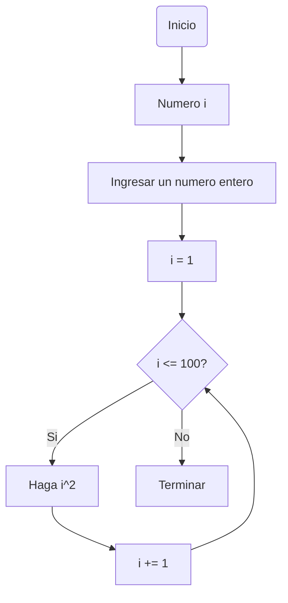
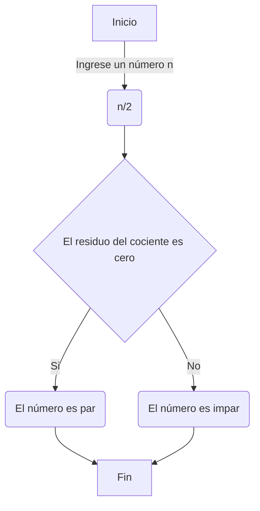

# Reto-siete

A continuacion los codigos propuestos del reto siete, cada uno con su arhivo.py individual y un notebook con todos estos incluidos:

### Codigo numero 1

- Imprimir un listado con los números del 1 al 100 cada uno con su respectivo cuadrado.

```Python

# Definir desde que valor se evaluara la condicion
i : int = 1

# Definir la condicion del bucle
while(i <= 100):
  cuadrado = i**2
  print("Numero: " + str(i) + " y su cuadrado: " + str(cuadrado))

# Incrementar el valor para que complete el bucle
  i += 1
```




