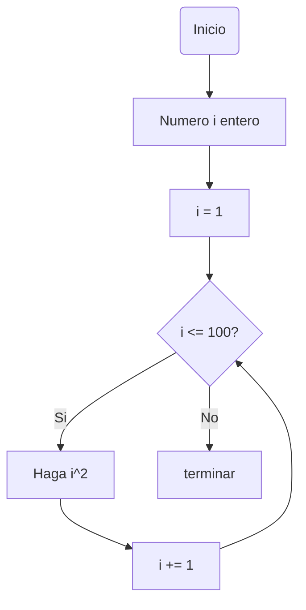
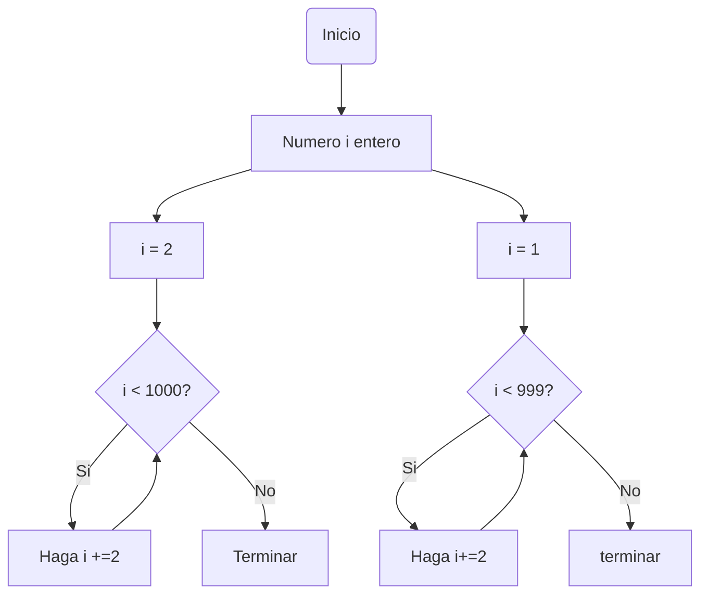
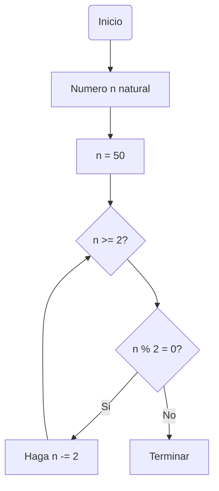

# Reto-siete

A continuacion los codigos propuestos del reto siete, cada uno con su arhivo.py individual y un notebook con todos estos incluidos:

### Codigo numero 1

- Imprimir un listado con los números del 1 al 100 cada uno con su respectivo cuadrado.

```Python

# Definir desde que valor se evaluara la condicion
i : int = 1

# Definir la condicion del bucle
while(i <= 100):
  cuadrado = i**2
  print("Numero: " + str(i) + " y su cuadrado: " + str(cuadrado))

# Incrementar el valor para que complete el bucle
  i += 1
```



### Codigo numero 2

- Imprimir un listado con los números impares desde 1 hasta 999 y seguidamente otro listado con los números pares desde 2 hasta 1000.

```Python

# Definir desde que valor se evaluara la condicion del primer bucle
i : int = 1

# Definir la condicion del primer bucle
while(i < 999):
  i += 2
  print("Numero: " + str(i))

# Definir desde que valor se evaluara la condicion del segundo bucle
i : int = 2
# Definir la condicion del segundo bucle
while(i < 1000):
  i += 2
  print("Numero: " + str(i))
```



### Codigo numero 3

- Imprimir los números pares en forma descendente hasta 2 que son menores o iguales a un número natural n ≥ 2 dado.

```Python

# Definir desde que valor se evaluara la condicion
n: int = 50

# Definir la condicion del bucle
while n >= 2:
    if n % 2 == 0:
        print(n)
    n -= 2
    print(str(n))
```


